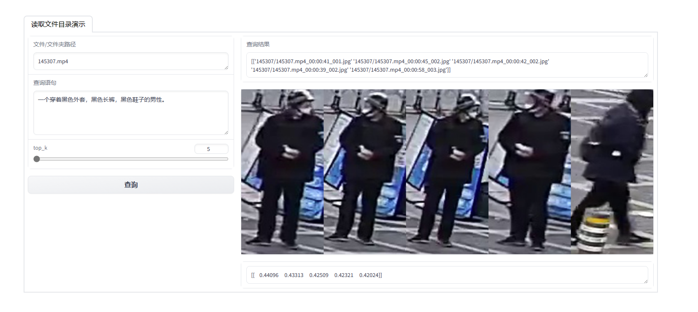

# An APTM-based pedestrian retrieval application

## features
### evaluate model by hit_ratio and mean_reciprocal_rank metrics.
### a simple person retrieval web demo:
1. input video (or img_root) and retrieval text.
2. use yolov5 model to crop person image (if input is video).
3. Chinese to English translation.
3. extract image and text features. (upload to weaviate database.)
4. retrieval. (from weaviate database.)

## download model weights
1. [bert-base-uncased](https://huggingface.co/google-bert/bert-base-uncased) -> ./bert-base-uncased/
2. [ft_cuhk_model](https://github.com/Shuyu-XJTU/APTM) -> ./ft_cuhk/
3. [Ch2En](https://huggingface.co/liam168/trans-opus-mt-en-zh) -> ./translate_ch_en/trans-opus-mt-zh-en/
4. yolo model

## APTM
Ref [APTM](https://github.com/Shuyu-XJTU/APTM)

## [Weaviate database](https://weaviate.io/developers/weaviate)

retrieval top10/10000 : 8ms
